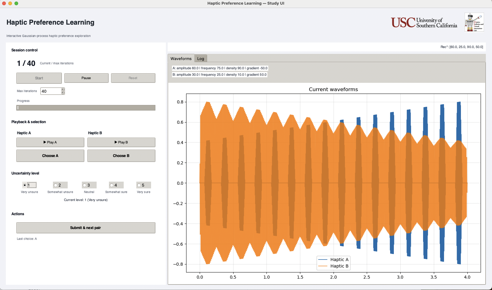

# 触觉偏好学习系统 / Haptic Preference Learning Toolkit

English README: [README.md](README.md)

本仓库提供一套**基于偏好的触觉个性化**框架：通过用户的**二元 A/B 选择**来学习潜在效用函数。我们采用**高斯过程（GP）偏好模型**建模刺激空间的平滑性与不确定性，并用**最大化期望信息增益**的**主动查询策略**选择下一组比较。用户可**自报不确定度**，系统将其作为**逐次比较的权重**以削弱含糊判断的影响。通过强调**相对判断**而非绝对打分，系统有效缓解用户疲劳与评分漂移，并避免将触觉感受强行映射到数值刻度。

**亮点**
- 基于 GP 的触觉偏好学习（不确定性建模与平滑先验）  
- 信息增益驱动的主动查询，样本效率更高  
- **逐次比较加权**（融合用户不确定度）稳健处理模糊答案  
- 开放、可扩展的交互式偏好搜索代码



## 快速上手
1. 克隆仓库：
   ```bash
   git clone https://github.com/iSanshi/haptic-preference-learning.git
   cd haptic-preference-learning
   ```
2. 建议使用虚拟环境（可选）：
   
3. 安装依赖：
   ```bash
   pip install -r requirements.txt
   ```

4. 启动界面：
   ```bash
   python run_user_study_ui.py   # 用户实验流程
   python run_auto_test_ui.py    # 自动测试流程
   ```

5. 点击 **Begin** 开始。用户实验模式需手动选择 A/B 音频并给出 1–5 的不确定度等级；自动测试模式由系统自动迭代。
6. 会话完成后，数据会导出到 `data/YYYYMMDD_序号/` 下的 `session.json` 与 `log.txt`。

## 会话输出 (session.json)
导出文件保留旧字段，并新增结构化摘要：
- `final_summary`：GP 后验均值推荐点、搜索方法、参数边界、后验不确定性，以及（按模式）验证/测试指标。
- `metrics`：按迭代对齐的数组，如 `info_gain` 与 `posterior_best_mean`。
- `metadata`：会话模式、计划/完成查询次数、完成状态。

示例片段：
```json
{
  "final_summary": {
    "recommended_params": [61.2, 58.7, 64.0, 55.9],
    "recommended_score": 0.84,
    "method": "lbfgsb",
    "bounds": {"amplitude": [20.0, 100.0], "frequency": [20.0, 100.0], "density": [20.0, 100.0], "gradient": [20.0, 100.0]},
    "posterior_uncertainty": {"avg_pred_var": 0.12, "max_pred_var": 0.41},
    "validation": {"rounds": 3, "win_rate": 0.67, "records": [{"round": 1, "choice": "A", "level": 4}]},
    "test_metrics": {"pearson": 0.71, "spearman": 0.68, "regret": 0.09, "distance_to_optimum": 6.4}
  },
  "metrics": {
    "info_gain": [0.21, 0.19, 0.17],
    "posterior_best_mean": [0.41, 0.53, 0.61]
  },
  "metadata": {"mode": "User Study", "n_queries_planned": 35, "n_queries_completed": 35, "status": "complete"}
}
```

## 目录结构
```
.
├── requirements.txt
├── README.md
├── README.zh-CN.md
├── run_user_study_ui.py
├── run_auto_test_ui.py
├── tutorial
    ├── gp_interactive_Chinese.html
    └── gp_interactive_English.html
└── src
    └── preference_learning
        ├── __init__.py
        ├── audio
        │   ├── generator.py
        │   └── signal.py
        ├── gp
        │   ├── audio_gp.py
        │   ├── gaussian_process.py
        │   └── math_utils.py
        ├── evaluation.py
        └── interface
            ├── __init__.py
            ├── session.py
            ├── ui_study.py
            └── logo/
```
